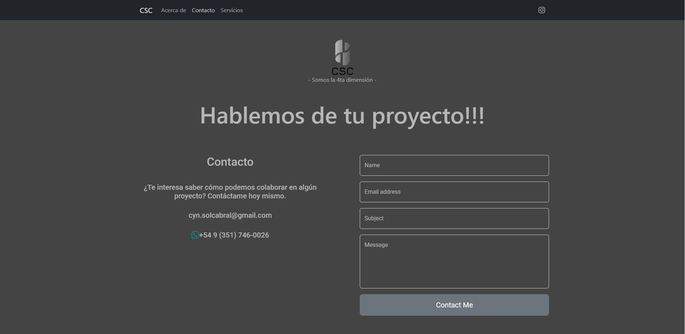

<h1 align="center">Hi 👋, I'm Diego</h1>
<h3 align="center">Self-taught Front End Developer</h3>

  

 

- 🔭 I’m currently working on **my own portfolio**

- 🌱 I’m currently learning **React**

- 👨‍💻 All of my projects will be available at [https://portfolio-cerveux.vercel.app/](https://portfolio-cerveux.vercel.app/)

- 💬 Ask me about **React, Javascript, MongoDB, NodeJS**

- 📫 How to reach me **cerveux@hotmail.com**

   

<h3 align="left">Connect with me:</h3>

<h3 align="left">🧰 Languages and Tools:</h3>

  

## My Projects

**CSC Renders**

Web created for CSC rendering studio.

